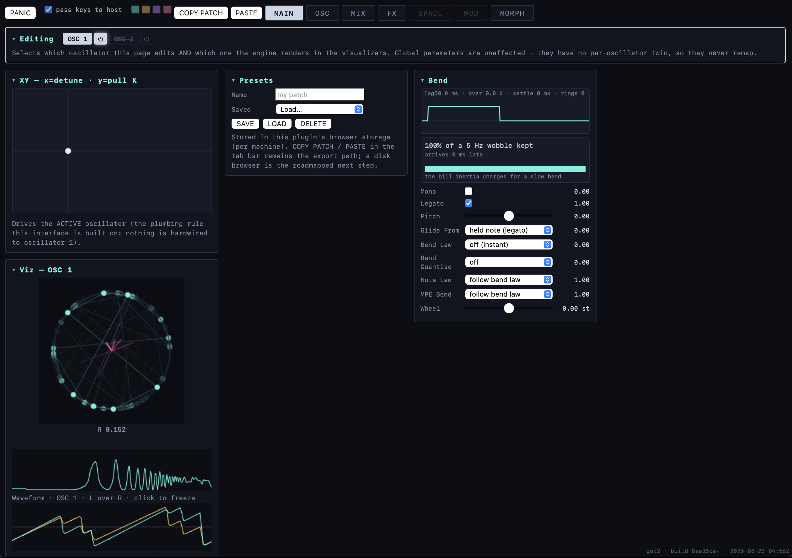

# HYPERSAW

**Working title:** horde (naming open until Phase 5; the prototypes keep their SWARM-prefixed names — SWARMSAW / SWARMSPECTRA / SWARMDYNAMICS — as historical identifiers; the repo answers to HYPERSAW. The former ✱ house mark was retired 2026-08-17.)

**One-line pitch:** a synthesizer built from a family of experimental, responsive engines with dynamical characteristics, oriented toward the sounds of hyperpop — beginning with the supersaw taken seriously as physics.

**Elevator version:** every existing supersaw picks a fixed detune recipe and hides it. horde makes the swarm itself the instrument: voices are Kuramoto-coupled oscillators you can herd into lock, dissolve into cloud, splay into harmonic multiplication, or erase by interference; the same coupling law operating between *notes* settles chords into just intonation; and every behavior is deterministic, seeded, and provenance-tracked.


*GUI2's MAIN page. See `docs/img/README.md` for the capture list and conventions —
the build hash in the corner of each shot says exactly which code drew it.*

## What this repo is

A working CLAP-native instrument plugin (VST3 + AUv2 via clap-wrapper) built from seven validated browser prototypes (three oscillator engines + a three-engine effects line + an experimental swarmalator), driven by Claude Code under the autonomous-paradigm doctrine. Correctness is defined as **bit-level parity with the prototypes** (L0-1, ε=1e-6 RMS — in practice most golden scenarios match to the exact bit), never as plausible-sounding audio. Every claim in SPEC.md traces to a measured behavior in ACCEPTANCE.md; every measured behavior traces to a prototype you can open and hear.

## Map

| Path | Purpose |
|---|---|
| `SPEC.md` · `SPEC-EFFECTS.md` · `SPEC-SWARMALATOR.md` · `SPEC-FORMANT.md` · `SPEC-DISTORTION.md` | The instrument, the effects line, the swarmalator, the formant engine (ADR-091) and the morphing waveshaper (ADR-092) — one spec per engine family member |
| `ACCEPTANCE.md` | Layer-0 and Layer-E criteria with measured numbers (+ ratified protocol notes) |
| `ROADMAP.md` | Phase-gated build plan, Phase 0 → 5 — **the single source of truth for status** |
| `DECISIONS.md` | ADR log, append-only (ADR-001…) |
| `PRIOR-ART.md` / `PARKED.md` | Competitive analysis · ideas register |
| `src/swarm_core.h` · `src/spectra_core.h` | The oscillator engines: header-only, pure, statement-level ports of the reference cores |
| `src/force_core.h` · `src/filter_core.h` | Track E: shared force system (ADR-034) + resonator bank on it |
| `src/hypersaw_clap.cpp` | CLAP shell: engine select, params, state, note/MPE handling, viz feed |
| `src/gui/` | Webview GUI (ADR-019 seam: `hypersaw_gui.h` is the swappable boundary) |
| `tools/` | The oracle: golden generator (Node, extracts the JS cores live), parity/trajectory/state checks, renderer bench |
| `traces/` | Provenance log — one entry per merged change set |
| `docs/` | Archived change notes, gate reports, (screenshots welcome: `docs/img/`) |

## Two interfaces, and which one you get

The repo carries **two** GUIs, and they are a **succession, not a fork**. As of
**2026-08-23 the succession completed**: `gui2.html` is what a default build embeds, and
`gui.html` is the legacy interface, kept building so the escape hatch stays real rather
than notional.

| | reaches | shape | build |
|---|---|---|---|
| **`src/gui/gui2.html`** — "GUI2" | **142 / 159** params | paged: MAIN · OSC · MIX · FX · MORPH (SPACE and MOD are stubs) | **what a default build embeds** |
| `src/gui/gui.html` — "GUI1", legacy | 102 / 159 params | one long single-oscillator column | opt in with `-DHYPERSAW_GUI2=OFF` |

```bash
cmake -S . -B build-release -G "Unix Makefiles" -DCMAKE_BUILD_TYPE=Release
cmake --build build-release -j
```

**Why the default moved.** The 2026-08-07 condition was "GUI2 swaps in when it reaches
parity", and it has — by reach (142/159 against 102/159) and by scope: GUI1 predates the
second oscillator, the mixer, the FX rack and the morph engine, and cannot show any of
them. It is no longer a smaller view of the same instrument; it is a view of an older one.
That is what makes it legacy rather than an alternative.

**What is interesting about GUI2**, beyond being newer: its controls are not hand-placed.
119 of them are **generated** from `src/param_presentation.tsv`, an address-keyed table of
label/page/group/widget, so adding a parameter means adding a row and a control can no
longer be forgotten. That table is deliberately separate from the parameter's *structure*
(ranges, ids) and carries **no id column at all**, because a page name that doubles as a
dispatch fact re-fuses the two things the split exists to separate. A `depends` column
generates the show/hide graph (ADR-108), so a control that only applies under some setting
says so in one place instead of in scattered markup.

Both are gated: `gui_reach` fails the build if any declared parameter is unreachable in
*every* GUI — which is how 29 silently dead controls were found and killed. Note the gate's
exact shape: it is an **either-GUI** check, so it does not by itself force GUI2 to complete
coverage. The 17-parameter gap is real and tracked, not hidden by a green gate.

## Reference implementations (the oracle)

Seven single-file HTML prototypes, each with a headless-testable DSP core separable from its UI. Three oscillator engines:

- `swarmsaw.html` (`SwarmSynth`) — saw-kernel swarm: bipolar K (sync/splay), inertia, R→tone, XY pad
- `swarmspectra.html` (`SpectraSynth`) — per-partial swarm: cascade locking, interference gating, width geography, stretch
- `swarmdynamics.html` (`DynSynth`) — topology (mean-field / nonlocal ring / two-cluster), Sakaguchi α, consonance gravity, tempo-grid law

Track E (effects line, ingested 2026-07-18 — SPEC-EFFECTS.md):

- `swarmfilter.html` — resonator bank on the shared force core (`FilterLab`)
- `swarmphaser.html` — notch swarm, exact SVF nulls (`PhaserLab`)
- `swarmtime.html` — tap-swarm delay + FDN room (`TimeLab`)

Plus `swarmalator.html` — the experimental swarmalator engine (position and phase co-evolving,
ADR-048), ported to `swarmalator_core.h` and gated, but not yet in the shell.

**And the first member of the new engine family** (ADR-091): `horde_formant_pulsar_fof.html` — the
**formant engine** (working name CANTO): FOF / pulsar grain synthesis where the fundamental is a
firing rate, formants are masses on springs in log-frequency with their own coupling K, and one
hidden register state reshapes the whole engine as pitch descends. Spec: `SPEC-FORMANT.md`. Status:
prototype validated by ear, **candidate oracle** — its masking RNG must be seeded before it can
generate goldens. Not in the shell, and **its future is an open question rather than a plan**: the
polyphonic-choir lab called for in ROADMAP F2 was built (`docs/design/formant-lab.html`) and its
polyphony was then **reverted** on 2026-08-23 — the human heard the output cut out past six voices
while every in-page instrument reported healthy, and their verdict on the sound settled it. The lab
is monophonic, keeps the formant detune width and the grain de-click, and the standing question is
whether this engine belongs in horde at all (ADR-091 A4).

These are the reference implementation per ADR-003. The C++ port must match them (parity oracle), and their headless test harnesses are the templates for `./verify fast`.

## Repo status

*Last verified current: **2026-08-23**.* (ROADMAP.md is the authoritative status trail; this is the
human-readable snapshot. A dated line that is honestly stale beats a confident one that is quietly
wrong — if this date is old, trust ROADMAP.md.)

- **Phases 0–4 CLOSED.** A shippable, playable instrument with two selectable engines (**HYPERSAW** /
  **SPECTRA** — the first renamed from SAW 2026-08-17, ADR-091) and the dynamics layer live inside
  HYPERSAW. HYPERSAW carries the full surface — six detune laws, seeded distributions, drift, ADSR,
  density comp, width + super-width, mono/glide/legato, phase and pan scatter. SPECTRA is the
  per-partial swarm, ported bit-exact, with the strip visualizer, up to 32 partials, and a per-voice
  sub-oscillator (ADR-042). Performance/IO: MPE per-note pitch, the transposition suite, bass-mono
  output, COPY/PASTE STATE, session persistence.
- **Two oscillators** (ADR-082): `kNumOsc = 2`, the second silent and disabled by default. Measured
  cost of enabling it is **2×** the voice loop; disabled it costs **0.03% of a core**, because the
  skip path means a disabled oscillator does not run at all rather than running quietly
  (`docs/research/2026-08-22-two-osc-cpu-measurement.md`).
- **The morph engine** (ADR-104 → ADR-112): an XY field over four corner snapshots, with Gumbel-max
  corner assignment, hysteresis, per-parameter exemption (right-click → *Exempt from morph*), an
  armed-corner authoring view, corner-colour coding on every row, and the field riding both the
  preset **and** the DAW session.
- **The oracle — `./verify fast|full`, 31 gates.** L0-1 parity is **156/156 scenarios, worst
  4.262e-09 RMS**, with goldens regenerated from the HTML references every run. Alongside parity sit
  the invariant probes that parity structurally *cannot* see: subdivision invariance, sample-rate
  independence, RT-safety (allocation-free audio thread), note-lifecycle fuzz, steal priority,
  forensic capture, GUI reachability, presentation-table totality, and the dependency graph. CI
  mirrors it on every push.
- **Note-lifecycle conformance against FOUNDATIONS.** Their ruled note behaviours run as a suite
  against **our** bookkeeping (`tools/conformance_check.cpp`): **8 passed · 0 ruled failures · 3
  library-default divergences**, plus our own timing-independent END ledger — every identity issued
  comes back through an END exactly once. The three divergences are ruled **conforming** (their R8:
  the rule constrains the *path*, not the *moment*). The gate **pins** that set, so a new failure
  *and* an unexpected pass both go red — good news is still drift.
- **A test table per page and feature.** `tests/feature_tests.tsv` — **124 tests, 68 agentic, 56
  human, 5 openly awaiting an oracle.** Every row declares whether it pins a **RULING** (a decision)
  or an **ENCODING** (how it happens to be done today) and names the owner, so a table survives a
  harness change. Coverage is checked against the GUI: a feature cannot appear on screen with no
  test row.
- **22 design labs** in `docs/design/` — benches where behaviour is auditioned before it becomes
  code. Recent arrivals: `modulator-lab.html` (shape as a routable axis rather than an enum; S&H as
  a sampler whose two kinds differ in the *clock*), `glitch-lab.html` (three state-tier modules that
  live *inside* the oscillator, seeded, with a self-test panel that ships one light deliberately
  dark rather than a green one it cannot trust), and `formant-lab.html`. Every lab is swept by a
  load gate, because a lab that throws at setup still *looks* fine — it has caught a window-only
  global and a stray backtick inside a worklet string that no amount of in-browser clicking would
  have explained.
- **Track E (effects line)** on the shared **force core** (ADR-034): resonator bank, notch swarm,
  time engines (tap delay + FDN room), the SWARM-FX effect shell, and the internal FX rack — now
  with NOTCH selectable as slot type 6. An open design question is queued: the rack's slot contract,
  where `amount` currently means four different things across six slots.
- **Validation**: pluginval strictness 10 SUCCESS · auval SUCCEEDED · Live load + play + MPE
  confirmed. Deferred by human direction: Windows runtime testing, Reaper/Bitwig loads.
- **Scheduled: Phase F — reference-path liberation** (ADR-041). At the E1 gate, "correct == bit-parity
  with the prototype" graduates to forward performance standards. Until then the parity discipline
  holds and additions use the superset-with-inert-defaults pattern.
- **Reference timeline** (ADR-011/012): prototypes update by in-repo edits with an ADR. Current
  `swarmsaw.html` is the v2 splay-legibility revision.

## Known gaps, stated rather than omitted

- ~~`build-macos` shows as *skipping* in CI.~~ **Retracted 2026-08-16 — this was never a gap, and
  it was asserted here without being checked.** The skip is deliberate and documented in
  `.github/workflows/ci.yml`: the account hit its free Actions minutes, macOS runners bill 10×, so
  PRs run the coverage this dev Mac *cannot* produce (Linux + Windows) while **`build-macos` runs on
  push to `main` as the post-merge net** — and macOS is precisely the platform `./verify full`
  already covers locally on every change. Verified: the last six pushes to `main` all succeeded.
- **Five** test-table rows have **no oracle yet** — they are listed in `tests/feature_tests.tsv` and
  counted by the gate rather than quietly carried.
- **GUI2 reaches 142 of 159 declared parameters.** `gui_reach` is an either-GUI check, so it stays
  green while that gap exists; the gap is tracked here instead of being inferred from a green gate.
- **Two probes are built but not gated** — `mixer_check` and `corner_probe` run clean and are not
  wired into `./verify`, which is a human call on gate scope, not an oversight.
- **In-page WebAudio health readouts are not trustworthy** and the labs deliberately show none: an
  AnalyserNode taps the graph rather than the device, and `ctx.currentTime` is the device clock,
  which advances straight through an underrun. Both reported healthy audio through three rounds
  while a human heard the output cutting out (ADR-091 A4).
- Feedback routing in the **modulation** graph is now **ruled** (2026-08-17): cycles are legal,
  every feedback edge carries a **unit delay at block rate**. Still lab-only in practice, but for
  a narrower reason — the *stability* bound is a separate open question, so a legal cycle is not
  yet a safe one. Feedback in the **audio** graph is a different question and untouched by that
  ruling.
