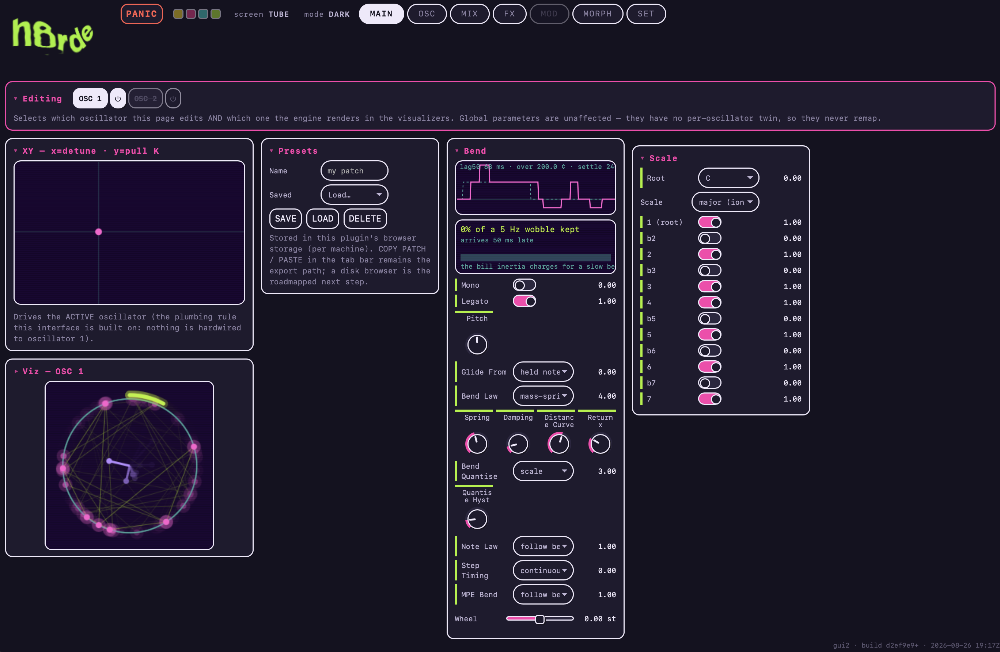
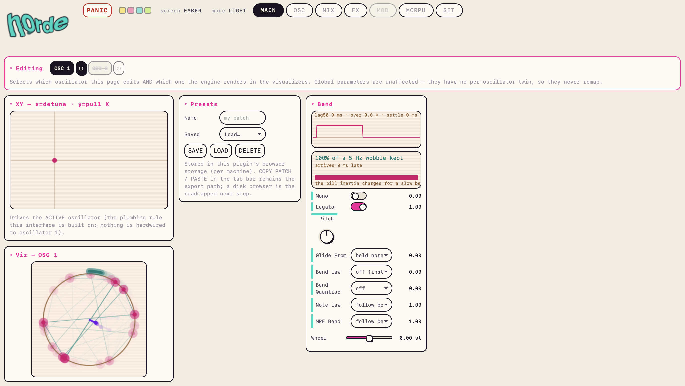
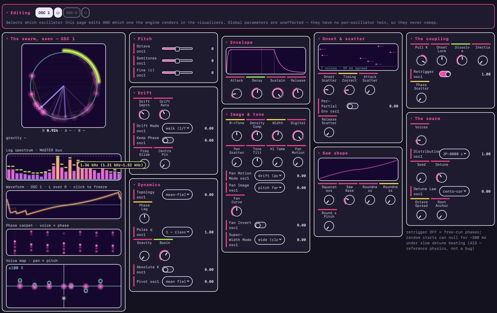
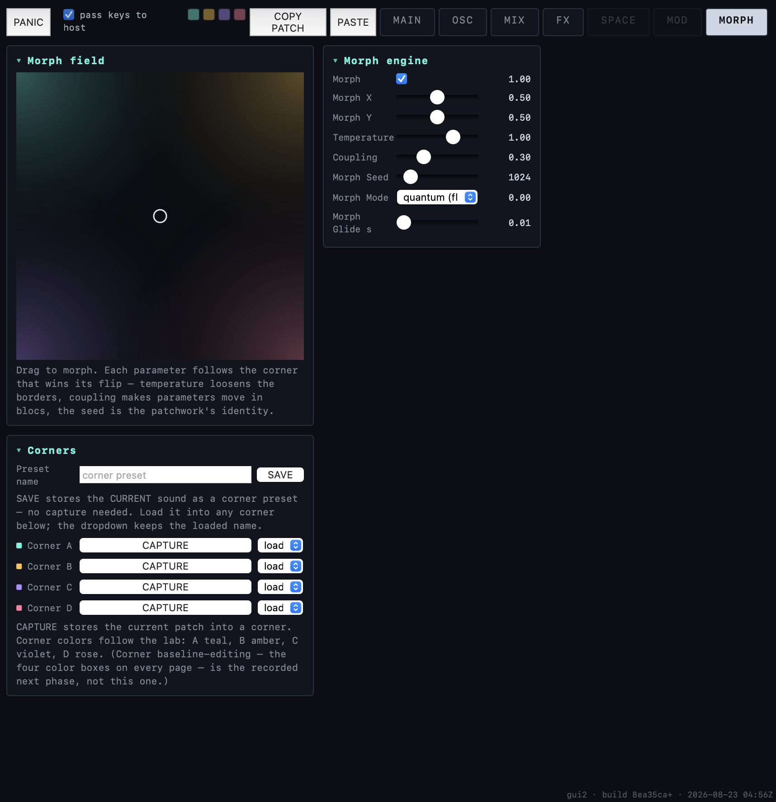

# horde

**A synthesizer built from coupled-oscillator engines — the supersaw taken seriously as physics.**

Every supersaw you have used picks a fixed detune recipe and hides it. horde makes the swarm
itself the instrument: its voices are Kuramoto-coupled oscillators you can herd into lock,
dissolve into cloud, splay into harmonic multiplication, or erase by interference. Everything
is deterministic and seeded — the same patch and the same notes produce the same samples.

*Names: the **device** is **horde**; its founding **engine** is **SWARM SAW**, with **SPECTRA**
as its per-partial sibling. "HYPERSAW" is now only the repository's name and the frozen plugin
id hosts use to re-find saved sessions — so that id will keep saying `hypersaw` long after
nothing on screen does.*


*MAIN on the **dark** chassis with the **TUBE** screen: the XY pad, patch storage, the bend
laws with their step-response and vibrato-retention meters, the scale mask, and the swarm's
phase circle mid-note — the ring is the swarm, the violet vector is the order parameter, and
the green arc is where the voices have collected. The wordmark is not a graphic; it is being
warped live by the engine. Build hash sits bottom-right of every shot — that is which code
drew it.*


*The **same page** on the **light** chassis with the **EMBER** screen. Chassis and screen are
two independent axes, which is why this is a pair rather than a variant: the layout, the
signal colours and their meanings are identical — only the ground and the phosphor moved.*

---

## What it does today

Two **oscillators**, each a full swarm, summed through a shared FX rack and a master stage.
The interface is six live pages plus a settings page.

### OSC — where the sound is built


*OSC carries the density: nine clusters of controls against five live visualisers. The
coloured bars above the knob labels are **corner ownership** — each one says which morph
corner currently owns that parameter. Hovering a spectrum bar reads out its frequency band.*

A swarm of up to 32 voices per oscillator with **six detune laws** and seeded distributions,
plus the parts that make it a *dynamical* system rather than a chorus: **coupling K** (positive
pulls voices into lock, negative splays them apart), **drift**, **gravity** toward consonance,
**topology** (mean-field, non-local ring, two-cluster), **onset scatter**, and a **saw shape**
section with squareness, roundness and pitch-dependent rounding. The visualizers are not
decoration — the phase circle shows the swarm's coherence, the voice map shows pan × pitch
(target against actual), and the phase carpet shows each voice's phase over time.

### MIX — balance and output

Per-oscillator power, level, tuning, mute/solo and meters; master volume and transposition;
and the output stage — mono fold, bass-mono with an adjustable crossover, and 2× oversampling.
A disabled oscillator costs **0.03% of a core**: disabled means it does not run, not that it
runs quietly.

### FX — four slots in series

Four slots, order fixed by slot index, each with type / amount / tone. An `Off` slot is a
**bit-exact passthrough** that does not touch the buffer. Comp and Comb are real cores; Drive,
Filter and Gain are honest placeholders, labelled as such, kept because slot *order* is audible
even with them.

### MAIN — performance

Bend behaviour is a first-class surface: **five travel laws** (off, constant time, constant
rate, lag, mass-spring), quantisation to chromatic or to a scale in three flavours, a step
grid, and an on-screen wheel so every one of them is auditionable without hardware. Glide
sources, mono/legato, and MPE per-note bend live here too.

---

## Eight things that work differently

Where one of these resembles a category that already exists, the comparison is named in italics
rather than skipped; `PRIOR-ART.md` carries the full accounting.

### Voices that listen to each other

Turn one knob — **coupling** — and a stack of detuned voices stops being a stack. Low, they
drift as a loose cloud. Raise it and they begin to herd, then shimmer, then lock into what
sounds like a single fat oscillator; the sound thins and focuses as they agree. Turn it
*negative* and they push apart instead, multiplying harmonics, and far enough out they start
cancelling each other into hollow, combed shapes.

Nothing is being crossfaded or morphed between those states. The voices are **coupled
oscillators**, each one nudged by what the others are doing, and the coupling knob is the
strength of that nudge. Every texture along the way is the same physical system finding a
different equilibrium — which is why the transitions sound continuous and slightly alive
rather than like a blend between presets.

*Coupled oscillators in audio are not unheard of — Chiral Audio's Foxfire ships a Kuramoto
chorus built on coupled LFOs, and there is a research lineage worth reading. What has no
shipping analogue found is using them as the synthesis engine itself.*

### Inertia — the swarm has weight

Add **inertia** and the voices stop responding instantly. Reach for lock and they swing past it
and settle back; let go and they coast before they scatter. The sound gains a lag between your
hand and the result, and lock becomes something the swarm *arrives at* rather than something it
is set to — earned on the way in, and lost reluctantly on the way out.

Technically the oscillators gain momentum, which turns the whole thing from a first-order
system into a second-order one. Practically it is the difference between a control and a thing
with weight.

### Detune as two decisions instead of one

Most instruments give you a detune amount and one built-in idea of where the voices go. Here
that splits into two menus you set independently, which is a much larger space than one slider.

**Where the voices sit** — spread evenly, along the classic JP-8000 curve, or scattered by a
seeded random shape (a gentle Gaussian bunching, or a Cauchy one with occasional far outliers)
— or placed at golden-ratio spacings that never repeat.

**What the spacing means** — the same amount can hold constant in *cents* (musically even),
constant in *Hz* (so low notes spread wider), even to the **ear** rather than to the maths, or
snapped to the **session tempo**, so the beating between voices lands on the beat. The last two
are the unusual ones: perceptually flat detune, and detune you can dial into rhythm.

*Serum 2's unison tuning modes prove players already read "tuning mode as a menu"; the
statistical, perceptual and metrical axes are the extension.*

### Consonance gravity — chords that settle into tune

Play a chord and the notes **drift into just intonation** — you hear the beating slow down and
stop, over a settling time you control. A *basin* sets how far out of tune a note can be and
still be pulled in; a *strength* sets how hard the pull is. Turn it up and the instrument
tunes itself as you play; turn it down and equal temperament stays exactly where you put it.

The pull is not a retuning rule applied to your notes before they reach the synth — it is a
force acting on the oscillators themselves, which is why the approach to tune is something you
*hear happening* rather than something that has already happened.

*Adaptive just intonation is a mature category — Hermode, Pivotuner, Alt-tuner. Those are
MIDI-domain rule engines that rewrite notes upstream of the synth; this is the same
`sin(error)` law that runs the unison swarm, operating one level up.*

### A pitch wheel with weight on it

Move the wheel and the pitch does not simply follow it. You choose **how** it travels: straight
there, taking the same *time* regardless of distance, moving at a constant *speed* so far bends
take longer, easing in like a slider with friction — or hanging off a **spring**, where the
pitch overshoots the target, swings back, and settles, with the spring's stiffness, damping and
return strength under your hands.

The spring setting is the one that changes how you play. A fast flick and a slow lean produce
genuinely different gestures from the same wheel, because you are moving a thing with mass
rather than addressing a number.

The same five behaviours drive **note-to-note glide**, so a legato slide and a wheel bend feel
like the same instrument rather than two unrelated features.

### Bend that stays in key

Set a scale and the pitch wheel stops being continuous: bends land **on the degrees of that
scale** instead of gliding through everything between. Bend up a tone and you arrive at the
next note *of the key*, not at whatever pitch the wheel happened to reach — so a bend is a
musical interval rather than a smear, and you can play expressively in a key without listening
for the edges of it.

Four modes cover the useful cases: **chromatic** (every semitone), **scale** (only the degrees
you have enabled), **scale (drag)** — which quantises the *destination* while letting the
journey there stay smooth — and **scale (offset)**, which keeps the interval you played rather
than the absolute pitch, so the same gesture transposes with the note.

Two details do the work that makes it feel solid rather than fussy. Quantising is **anchored to
the note you started from**, so releasing a bend returns you to exactly the pitch you played,
never a neighbouring degree. And a **hysteresis** control (in cents) keeps a bend parked between
two degrees from flickering between them — it has to travel meaningfully past the boundary
before it commits.

### The quantum morph — every parameter picks a side

Put four complete patches in the corners of a pad and move between them. **Each parameter is
assigned whole to one corner patch by a deterministic Gumbel-max law rather than crossfaded**,
so what you hear in between is a *patchwork* of the four sounds rather than an average of them.

That matters most for the parameters that cannot be averaged. A filter type, a waveform, an
oscillator being on — crossfading those means a discrete control snapping at the halfway point
and a state that belongs to no patch at all. Here they **flip coherently** instead, and
parameters that only make sense together flip together.

Three controls shape the patchwork: **temperature** loosens the borders so a corner's influence
reaches further, **coupling** makes parameters flip in blocs rather than independently, and the
**seed** fixes the whole arrangement — the same seed and position give you the same patchwork
every time, on any machine, so an accident you liked is somewhere you can return to.

*Morph pads themselves are not new — NI Super\*Saw ships X/Y state morphing. The assignment law
is what differs.* **Mechanics: §The morph grid below.**

### Humanization that behaves like an ensemble

Voices enter slightly apart, the way a real section does — but the interesting control is not
*how far* apart. It is how hard the voices try to correct back toward each other.

Leave them uncorrected and they wander: each entry drifts from the last, and the ensemble comes
apart over time like players who cannot hear one another. Correct too hard and they snap onto
the grid, which is tight but lifeless. In between there is a setting where voices pull toward
the group without ever quite arriving — always slightly early or slightly late, always
recovering — and that is what a real ensemble sounds like.

The reason it works is that listeners judge togetherness from the *pattern* of the timing
errors rather than their size. Each voice nudges itself toward the group's average and adds a
little motor noise of its own, which is the model measured from actual string quartets
(Vorberg/Wing): `offset ← offset − α·(offset − group average) + noise`.

Measured from the shipped engine — the **lag-1** column is the pattern, and it is the thing
conventional humanize cannot produce:

| α | onset SD | lag-1 autocorrelation | what it is |
|---|---|---|---|
| 0 | 202 ms | +0.985 | a random walk — drifts without bound |
| **0.25** | **35.8 ms** | **+0.679** | bounded, *with structure* — real quartets |
| 1.0 | 26.4 ms | −0.072 | i.i.d. — **exactly what conventional humanize produces** |
| 1.5 | — | −0.550 | over-correction: alternating early/late |

Read the bottom rows: the familiar "humanize" sound is not an alternative to this control, it
is **one specific value of it** — α = 1.0, where every voice corrects fully and the errors stop
relating to each other at all. It is available here, and it is not the musical setting.

### Routing you can morph through

Connections between modules are **amounts, not switches**. A connection at zero is simply a
connection turned all the way down, so patching something in or out is a move you can make
gradually — and, more to the point, a move the morph pad can make *for* you as you travel
between corners. Signal flow becomes something that changes with the sound rather than a layout
you set beforehand and leave alone.

---

## The morph grid


*The morph field, with the cursor parked off-centre. The four corner colours in the gradient
are the same four that mark parameter ownership everywhere else in the interface — that is the
whole idea in one picture: a patch is a position in a field, and every parameter belongs to
whichever corner won it.*

The feature that makes horde a *patch explorer* rather than a synth with a lot of knobs.

Four corners each hold a complete snapshot of the patch. The field **starts at 100% corner A**,
not in the middle: at a corner every parameter is owned by one snapshot, so the morph behaves
like an ordinary patch until you choose to move. Drag the XY field and every parameter
independently decides which corner it follows — this is **not** a crossfade. Each parameter
runs its own weighted draw, so moving across the field re-assembles the patch out of the four
corners rather than averaging them into mush. The controls that shape it:

- **Temperature** — how sharply a parameter commits to the nearest corner. Low is decisive;
  high loosens the borders so parameters start disagreeing near the middle.
- **Coupling** — whether parameters flip independently or move in blocs.
- **Seed** — the identity of the patchwork. The same seed always assembles the same way, so a
  field you like is a number you can write down.
- **Morph Glide** — how long a flip takes to travel.
- **Mode** — quantum (flip) or blend.

And the authoring side:

- **Corner colour coding.** Every parameter row on every page wears a stripe in the colour of
  the corner currently driving it, so you can see the patchwork rather than infer it.
- **Arm a corner** (the four colour boxes in the tab bar) and the interface shows *that
  corner's* stored settings instead of the live sound — you edit what you are looking at.
  Rows it owns but is not currently voicing go dotted.
- **Exempt a parameter** (right-click → *Exempt from morph*) to pull it out of the field
  entirely and hold it steady while everything else moves.
- Corners save and load as presets, and the whole field rides the DAW session.

---

## Coming through the pipeline

Ported and oracle-covered, but not yet reachable in the shipped interface, or still in design:

| | |
|---|---|
| **SPECTRA** | The per-partial sibling: a coupled *cloud on every partial*, so lock can cascade up the harmonic series and splay can erase partials by interference. Finished and parity-covered; gated behind the engine-roster decision. |
| **Swarmalator** | Oscillators whose phase and *position* are coupled to each other — synchronisation and spatialisation as one system. Ported, gated, deliberately parked. |
| **CANTO** | A formant engine (FOF/pulsar grains) where the formants are **masses on springs** rather than filter settings. |
| **WARP** | A morphing waveshaper with **hysteresis** — the shape depends on where the signal has been, not only where it is. Destined for the shared post-stage. |
| **STATION** | The dependable one: 3-operator phase modulation with an LFSR noise channel. Explicitly maximal coverage per CPU cycle. |
| **The FX rework** | Set modules behind a crosspoint matrix with feedback, ruled to carry a **one-sample** delay rather than a block-rate one, so a patch cannot sound different at a different buffer size. |

## Where it is going

`ROADMAP.md` is the authoritative plan; the short version of what is queued:

| | |
|---|---|
| **Modulation** | The instrument has no LFOs yet — nothing moves unless you move the morph pad. The modulator lab is built and the routing matrix is ruled with two increments already in the audio path. The largest musical gap. |
| **The FX rework** | The live workstream. Variable slots become *set modules* behind a crosspoint routing matrix with feedback and bypass — which dissolves two open problems rather than patching them, since a module's presence becomes a coefficient and a coefficient of zero *is* "not connected". Existing patches port non-destructively. `docs/proposals/fx-matrix-rework.md`. |
| **Filters** | A filter page with routing owned at both ends (each oscillator chooses its destination, each filter chooses series/parallel/out), plus a simplified filter in the FX rack. The consolidated roster is settled; the external design gate lifted on 2026-08-11. |
| **Corner randomize** | A randomize button drawing on a bell curve around each parameter's default, with an initialize-corner inverse, so a corner is somewhere you can explore and get back from. |
| **The engine roster** | Which engines ship is an open decision — SPECTRA is finished but unreachable in the current interface, the swarmalator is ported and gated but never wired in, and the formant engine's future is genuinely undecided. Evidence: `docs/research/2026-08-23-engine-roster-decision.md`. |

---

## The look

The interface is a designed object, not a control dump, and its rules are small enough to
state.

**One ink, one accent, and signals that are never borrowed.** Every outline on the page is
the same ink (`#191521`); every colour beyond that has exactly one job and is never reused
for a second one:

| token | value | its one job |
|---|---|---|
| `--value` | `#F5169C` | the value **you** authored — nothing the machine decided |
| `--physics` | `#6431F0` | the system acting: order parameter, K vector, rotor lead |
| `--meter` | `#00D5C8` | analysers and the R rim arc |
| `--marker` | `#FFD702` | attention: root note, overshoot, lock front |
| `--celebrate` | `#A6F219` | meters in the green |

That discipline is why the panels stay readable at density: if a mark is pink you know a
human put it there, and if it is violet you know the swarm did.

**Two independent axes, not one theme switch.** The *chassis* is light (cream `#F2EDE2`) or
dark (`#151220`) and carries the whole page. The *screens* — the phosphor wells where data
lives — are themed separately, because a data surface and a control surface want different
grounds: **TUBE**, **ORCHID**, **FROST**, **EMBER**, **DUSK**. You can run a dark screen on a
light chassis, which is the combination the design actually favours.

Signal hues survive the chassis flip; only their *emission* moves (`--value` becomes
`#FF3DAD` on the dark ground). A hue that changed meaning between modes would make the
"one job each" rule a lie in half the product.

**Alpha is ground-dependent, and the tokens know it.** Low-alpha glow is a dark-ground
technique — it disappears on cream. A `--scr-alpha` multiplier lets a painter ask for
"faint" and lets the scheme decide what faint costs on its own ground, so no painter carries
per-theme special cases.

**The wordmark is played, not drawn.** `horde` is rendered live through a backward-remap
warp field — wave, tremor, blobs and swirls sampled per pixel — and when an engine is
running the synth drives it: the order parameter **R** becomes ripple, detune becomes wiggle,
and the morph position becomes colour, blended bilinearly from the same four corner hues the
pad uses. In light mode an ink outline carries the contrast so the fill can stay at full
saturation, which is the only way corner A's `#FFD702` is legible on cream at all
(measured 1.34:1 as a fill, which is why the outline exists).

Design sources: `docs/design-system/`, the labs in `docs/design/`, and the tokens themselves
at the top of `src/gui/gui2.html` — which is the authority, since the interface generates
its controls from them.

---

## How correctness is defined

Not "it sounds plausible". The C++ engines are **statement-level ports of browser prototypes**
that you can open and hear, and the oracle re-derives the goldens from those prototypes on
every run and compares:

- **`./verify fast | full` — 31 gates.** Parity is **156/156 scenarios within 1e-6 RMS**
  (worst 4.262e-09; most match to the bit).
- Alongside parity sit the probes parity structurally **cannot** see: subdivision invariance,
  sample-rate independence, RT-safety (no allocation on the audio thread), note-lifecycle fuzz,
  voice-steal priority, GUI reachability, presentation-table totality, and the dependency graph.
- **`tests/feature_tests.tsv`** — 124 tests, each declaring whether it pins a **RULING** (a
  decision that must not silently change) or an **ENCODING** (how it happens to be done today).
- Note-lifecycle **conformance** against a sibling project's ruled behaviours: 8 passed, 0 ruled
  failures, 3 divergences ruled conforming and pinned — so an unexpected *pass* also goes red.

Validated: pluginval strictness 10, auval, and load + play + MPE in Live.

## Build

CLAP-native, wrapped to VST3 and AUv2 by clap-wrapper.

```bash
cmake -S . -B build-release -G "Unix Makefiles" -DCMAKE_BUILD_TYPE=Release
cmake --build build-release -j
```

Pass `-DHYPERSAW_GUI2=OFF` for the legacy single-column interface (GUI1), which predates the
second oscillator, the mixer, the FX rack and the morph grid and cannot show any of them. It
is kept building so the escape hatch stays real.

## Map

| Path | Purpose |
|---|---|
| `ROADMAP.md` | Phase-gated plan — **the single source of truth for status** |
| `DECISIONS.md` | ADR log, append-only |
| `SPEC*.md` · `ACCEPTANCE.md` | One spec per engine-family member; measured acceptance criteria |
| `src/*_core.h` | The engines: header-only, pure, framework-free |
| `src/hypersaw_clap.cpp` | CLAP shell: params, state, notes/MPE, the morph field, viz feed |
| `src/gui/gui2.html` · `src/param_presentation.tsv` | The interface, and the table 119 of its controls are generated from |
| `tools/` | The oracle: golden generator, parity/trajectory/invariant checks |
| `docs/design/` | 22 labs — where behaviour is auditioned before it becomes code |
| `traces/` | Provenance log — one entry per merged change set |

## Status and known gaps

*Last verified: **2026-08-26** — every claim below re-checked against the gates on that date.
If this date is old, trust `ROADMAP.md` over this file.*

Stated rather than omitted:

- **SPECTRA — the second engine — is unreachable in the shipped interface.** All 17 of its
  parameters, including the engine selector, exist only in the legacy GUI. Deliberately parked
  pending the engine-roster decision above; it is not a bug to be fixed in passing.
- **`gui_reach` is an either-GUI check**, so it stays green while that gap exists. Recorded
  here because a green gate is exactly where a gap like this hides.
- **Six test-table rows have no oracle yet** — counted by the gate rather than quietly carried
  (`test_table_check` prints the number every run, which is why this line can be trusted to be
  current rather than remembered).
- **Two probes are built but not gated** (`mixer_check`, `corner_probe`) — a pending call on
  gate scope.
- **In-page WebAudio health readouts are untrustworthy**, and the labs deliberately show none:
  an analyser taps the graph rather than the device, and `ctx.currentTime` advances straight
  through an underrun. Both reported healthy audio through three rounds while a human heard the
  output cutting out.
- **Deferred by choice:** Windows runtime testing, Reaper/Bitwig loads.
