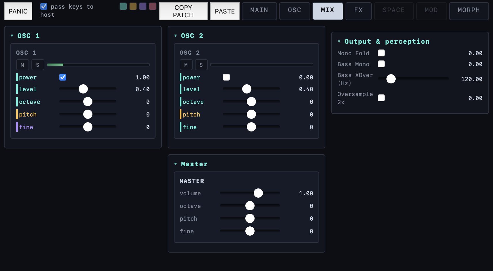
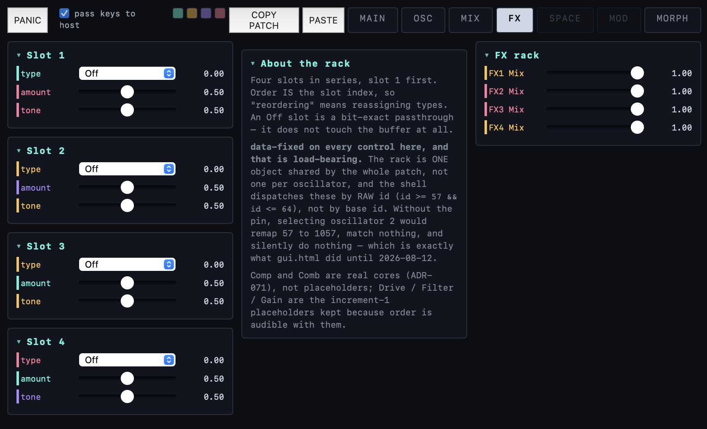

# horde

**A synthesizer built from coupled-oscillator engines — the supersaw taken seriously as physics.**

Every supersaw you have used picks a fixed detune recipe and hides it. horde makes the swarm
itself the instrument: its voices are Kuramoto-coupled oscillators you can herd into lock,
dissolve into cloud, splay into harmonic multiplication, or erase by interference. Everything
is deterministic and seeded — the same patch and the same notes produce the same samples.

*Names: the **device** is **horde**. **HYPERSAW** is the engine inside it (and the repo's own
name, and the plugin id hosts use to re-find saved sessions — that id is frozen forever, so it
will keep saying `hypersaw` long after nothing else does).*


*MAIN: the XY pad, the bend laws with their step-response and vibrato-retention meters, patch
storage, and the swarm's phase circle with its live order parameter R. Build hash is in the
bottom-right corner of every screenshot — that is which code drew it.*

---

## What it does today

Two **oscillators**, each a full swarm, summed through a shared FX rack and a master stage.
The interface is five live pages.

### OSC — where the sound is built


A swarm of up to 32 voices per oscillator with **six detune laws** and seeded distributions,
plus the parts that make it a *dynamical* system rather than a chorus: **coupling K** (positive
pulls voices into lock, negative splays them apart), **drift**, **gravity** toward consonance,
**topology** (mean-field, non-local ring, two-cluster), **onset scatter**, and a **saw shape**
section with squareness, roundness and pitch-dependent rounding. The visualizers are not
decoration — the phase circle shows the swarm's coherence, the voice map shows pan × pitch
(target against actual), and the phase carpet shows each voice's phase over time.

### MIX — balance and output



Per-oscillator power, level, tuning, mute/solo and meters; master volume and transposition;
and the output stage — mono fold, bass-mono with an adjustable crossover, and 2× oversampling.
A disabled oscillator costs **0.03% of a core**: disabled means it does not run, not that it
runs quietly.

### FX — four slots in series



Four slots, order fixed by slot index, each with type / amount / tone. An `Off` slot is a
**bit-exact passthrough** that does not touch the buffer. Comp and Comb are real cores; Drive,
Filter and Gain are honest placeholders, labelled as such, kept because slot *order* is audible
even with them.

### MAIN — performance

Bend behaviour is a first-class surface: **five travel laws** (off, constant time, constant
rate, lag, mass-spring), quantisation to chromatic or to a scale in three flavours, a step
grid, and an on-screen wheel so every one of them is auditionable without hardware. Glide
sources, mono/legato, and MPE per-note bend live here too.

---

## The morph grid


The feature that makes horde a *patch explorer* rather than a synth with a lot of knobs.

Four corners each hold a complete snapshot of the patch. Drag the XY field and every parameter
independently decides which corner it follows — this is **not** a crossfade. Each parameter
runs its own weighted draw, so moving across the field re-assembles the patch out of the four
corners rather than averaging them into mush. The controls that shape it:

- **Temperature** — how sharply a parameter commits to the nearest corner. Low is decisive;
  high loosens the borders so parameters start disagreeing near the middle.
- **Coupling** — whether parameters flip independently or move in blocs.
- **Seed** — the identity of the patchwork. The same seed always assembles the same way, so a
  field you like is a number you can write down.
- **Morph Glide** — how long a flip takes to travel.
- **Mode** — quantum (flip) or blend.

And the authoring side:

- **Corner colour coding.** Every parameter row on every page wears a stripe in the colour of
  the corner currently driving it, so you can see the patchwork rather than infer it.
- **Arm a corner** (the four colour boxes in the tab bar) and the interface shows *that
  corner's* stored settings instead of the live sound — you edit what you are looking at.
  Rows it owns but is not currently voicing go dotted.
- **Exempt a parameter** (right-click → *Exempt from morph*) to pull it out of the field
  entirely and hold it steady while everything else moves.
- Corners save and load as presets, and the whole field rides the DAW session.

---

## Where it is going

`ROADMAP.md` is the authoritative plan; the short version of what is queued:

| | |
|---|---|
| **Modulation** | The instrument has no LFOs yet — nothing moves unless you move the morph pad. The modulator lab is built and the routing matrix is ruled with two increments already in the audio path. The largest musical gap. |
| **Filters** | A filter page with routing owned at both ends (each oscillator chooses its destination, each filter chooses series/parallel/out), plus a simplified filter in the FX rack. |
| **Corner randomize** | A randomize button drawing on a bell curve around each parameter's default, with an initialize-corner inverse, so a corner is somewhere you can explore and get back from. |
| **The engine roster** | Which engines ship is an open decision — SPECTRA is finished but unreachable in the current interface, the swarmalator is ported and gated but never wired in, and the formant engine's future is genuinely undecided. Evidence: `docs/research/2026-08-23-engine-roster-decision.md`. |

---

## How correctness is defined

Not "it sounds plausible". The C++ engines are **statement-level ports of browser prototypes**
that you can open and hear, and the oracle re-derives the goldens from those prototypes on
every run and compares:

- **`./verify fast | full` — 31 gates.** Parity is **156/156 scenarios within 1e-6 RMS**
  (worst 4.262e-09; most match to the bit).
- Alongside parity sit the probes parity structurally **cannot** see: subdivision invariance,
  sample-rate independence, RT-safety (no allocation on the audio thread), note-lifecycle fuzz,
  voice-steal priority, GUI reachability, presentation-table totality, and the dependency graph.
- **`tests/feature_tests.tsv`** — 124 tests, each declaring whether it pins a **RULING** (a
  decision that must not silently change) or an **ENCODING** (how it happens to be done today).
- Note-lifecycle **conformance** against a sibling project's ruled behaviours: 8 passed, 0 ruled
  failures, 3 divergences ruled conforming and pinned — so an unexpected *pass* also goes red.

Validated: pluginval strictness 10, auval, and load + play + MPE in Live.

## Build

CLAP-native, wrapped to VST3 and AUv2 by clap-wrapper.

```bash
cmake -S . -B build-release -G "Unix Makefiles" -DCMAKE_BUILD_TYPE=Release
cmake --build build-release -j
```

Pass `-DHYPERSAW_GUI2=OFF` for the legacy single-column interface (GUI1), which predates the
second oscillator, the mixer, the FX rack and the morph grid and cannot show any of them. It
is kept building so the escape hatch stays real.

## Map

| Path | Purpose |
|---|---|
| `ROADMAP.md` | Phase-gated plan — **the single source of truth for status** |
| `DECISIONS.md` | ADR log, append-only |
| `SPEC*.md` · `ACCEPTANCE.md` | One spec per engine-family member; measured acceptance criteria |
| `src/*_core.h` | The engines: header-only, pure, framework-free |
| `src/hypersaw_clap.cpp` | CLAP shell: params, state, notes/MPE, the morph field, viz feed |
| `src/gui/gui2.html` · `src/param_presentation.tsv` | The interface, and the table 119 of its controls are generated from |
| `tools/` | The oracle: golden generator, parity/trajectory/invariant checks |
| `docs/design/` | 22 labs — where behaviour is auditioned before it becomes code |
| `traces/` | Provenance log — one entry per merged change set |

## Status and known gaps

*Last verified: **2026-08-23**. If this date is old, trust `ROADMAP.md` over this file.*

Stated rather than omitted:

- **SPECTRA — the second engine — is unreachable in the shipped interface.** All 17 of its
  parameters, including the engine selector, exist only in the legacy GUI. Deliberately parked
  pending the engine-roster decision above; it is not a bug to be fixed in passing.
- **`gui_reach` is an either-GUI check**, so it stays green while that gap exists. Recorded
  here because a green gate is exactly where a gap like this hides.
- **Five test-table rows have no oracle yet** — counted by the gate rather than quietly carried.
- **Two probes are built but not gated** (`mixer_check`, `corner_probe`) — a pending call on
  gate scope.
- **In-page WebAudio health readouts are untrustworthy**, and the labs deliberately show none:
  an analyser taps the graph rather than the device, and `ctx.currentTime` advances straight
  through an underrun. Both reported healthy audio through three rounds while a human heard the
  output cutting out.
- **Deferred by choice:** Windows runtime testing, Reaper/Bitwig loads.
